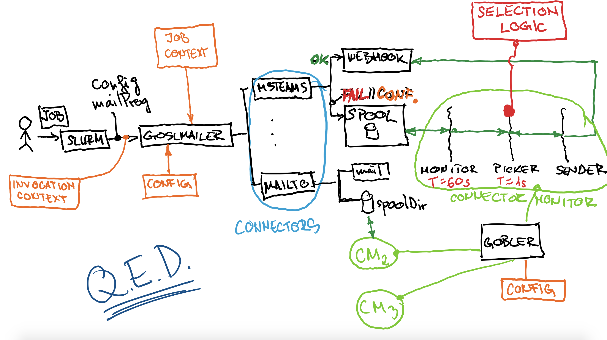
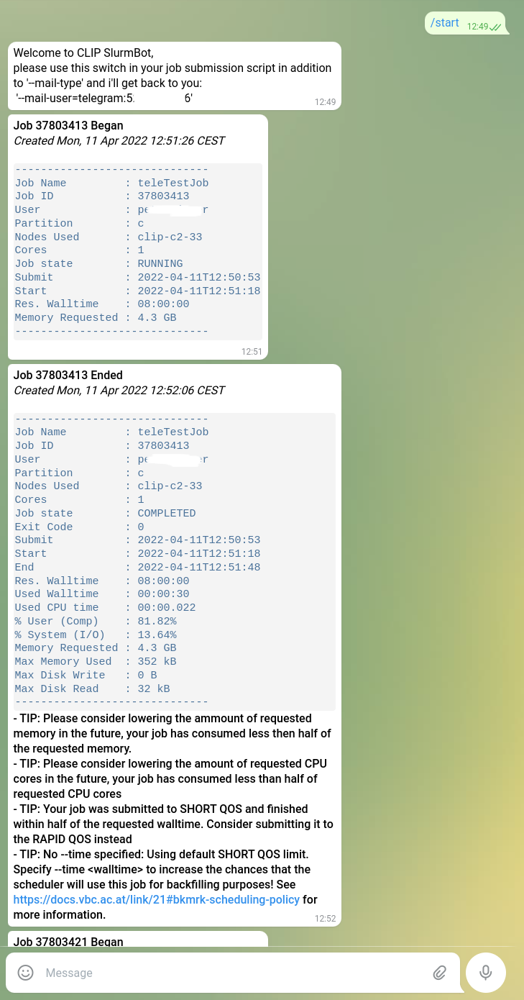
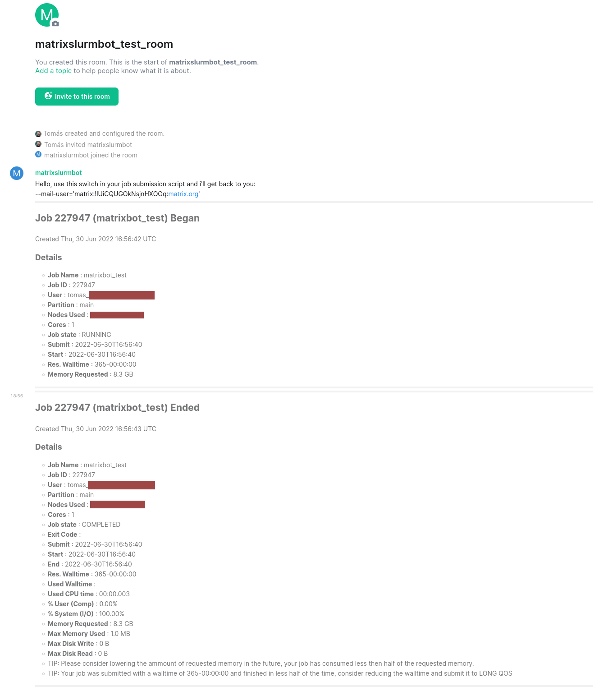
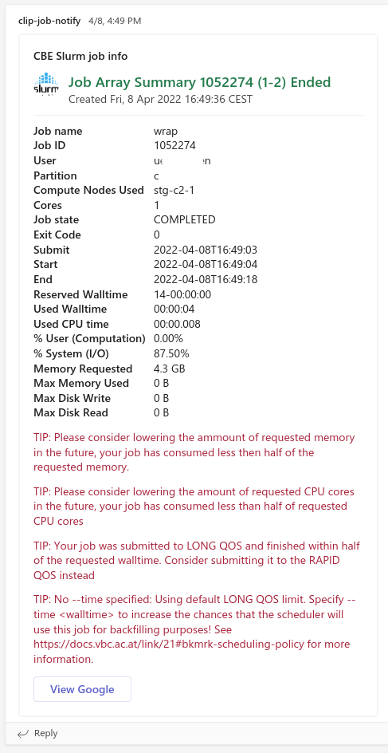

# goslmailer

> **Info**
> Now also works with SLURM < 21.08
>
> For templating differences between slurm>21.08 and slurm<21.08 see [templating guide](./templates/README.md)

## Drop-in notification delivery solution for slurm that can do:

* message delivery to: 
  * [**discord**](https://discord.com/)
  * [**matrix**](https://matrix.org/)
  * [**telegram**](https://telegram.org/)
  * [**msteams**](https://teams.com)
  * [**e-mail**](https://en.wikipedia.org/wiki/Email)
* gathering of job **statistics**
* generating **hints** for users on how to tune their job scripts (see examples below)
* **templateable** messages ([readme](./templates/README.md))
* message **spooling** and **throttling**, [details here...](#spooling-and-throttling-of-messages---gobler-service)
* easy to develop extensions for other protocols, [more here...](./connectors/connectorX/README.md) 

---

## Description

**Goslmailer** (GoSlurmMailer) is a drop-in replacement [MailProg](https://slurm.schedmd.com/slurm.conf.html#OPT_MailProg) for [slurm](https://slurm.schedmd.com/).


With goslmailer configured as as the slurm mailer,

```
MailProg                = /usr/bin/goslmailer
```

it provides users with the ability to specify a comma-separated list of receivers `[connector:]target` in the sbatch `--mail-user` switch to select where the messages will be sent out (similar to [URI scheme](https://en.wikipedia.org/wiki/Uniform_Resource_Identifier#Syntax)).

e.g.

```
sbatch --mail-type=ALL --mail-user="mailto:useremailA,msteams:usernameB,telegram:NNNNNNN,usernameC"
```

To support future additional receiver schemes, a [connector package](connectors/) has to be developed and its [configuration block](cmd/goslmailer/goslmailer.conf.annotated_example) present in configuration file.

## Currently available connectors:

* [**discord**](#discord-connector) todo.
* [**matrix**](#matrix-connector) bot --mail-user=`matrix:`roomId
* [**telegram**](#telegram-connector) bot --mail-user=`telegram:`chatId
* [**mailto**](#mailto-connector) --mail-user=`mailto:`email-addr
* [**msteams**](#msteams-connector) webhook --mail-user=`msteams:`userid

See each connector details below...

### If you would like to contribute to this project by developing a new connector, [here](./connectors/connectorX/README.md) is a heavily annotated connector boilerplate (fully functional) to help you get started.

---

## Building and installing

### Build

#### Quick version, without end to end testing

```
git clone https://github.com/CLIP-HPC/goslmailer.git
make test
make build
make install
```

#### Slightly more involved, with end to end testing:

Prerequisites:

1. generated RSA keypair (passwordless) (`ssh-keygen -t rsa`)
2. `ssh $USER@localhost` must work without password

Known caveats:

* redhat/centos: must have lsb_release binary installed, package: `redhat-lsb-core`
* ubuntu 22: `set enable-bracketed-paste off` present in `~/.inputrc`
* maybe/maybe not, depends if you see failed tests: `export TERM=dumb` in `~/.bashrc` :)

```
# downloads endly binary and runs endly tests
make 
```

### Install

#### goslmailer

* place binary in a path to your liking
* place [goslmailer.conf](cmd/goslmailer/goslmailer.conf.annotated_example) here: `/etc/slurm/goslmailer.conf` (default path)
  * OR: anywhere else, but then run the binary with `GOSLMAILER_CONF=/path/to/gosl.conf` in environment
* point slurm `MailProg` to the binary

#### gobler

* place binary in a path to your liking
* place [gobler.conf](cmd/gobler/gobler.conf) in a path to your liking
* start the service (with -c switch pointing to config file)

#### tgslurmbot

* place binary in a path to your liking
* place [tgslurmbot.conf](cmd/goslmailer/goslmailer.conf.annotated_example) in a path to your liking
  * config file has the same format as [goslmailer](cmd/goslmailer/goslmailer.conf.annotated_example) , so you can use the same one (other connectors configs are not needed)
* start the service (with -c switch pointing to config file)

#### matrixslurmbot

* place binary in a path to your liking
* place [matrixslurmbot.conf](cmd/goslmailer/goslmailer.conf.annotated_example) in a path to your liking
  * config file has the same format as [goslmailer](cmd/goslmailer/goslmailer.conf.annotated_example), so you can use the same one (other connectors configs are not needed)
* start the service (with -c switch pointing to config file)


---


## Spooling and throttling of messages - gobler service

In high-throughput clusters or in situations where job/message spikes are common, it might not be advisable to try to send all of the incoming messages as they arrive.
For these environments goslmailer can be configured to spool messages from certain connectors on disk, to be later processed by the **gobler** service.

**gobler** is a daemon program that can be [configured](cmd/gobler/gobler.conf) to monitor specific spool directories for messages, process them and send out using the same connectors as goslmailer.


On startup, gobler reads its config file and spins-up a `connector monitor` for each configured spool directory.


`connector monitor` in turn spins up 3 goroutines: `monitor`, `picker` and `numSenders` x `sender`.

* **monitor** :
  * every `monitorT` seconds (or milliseconds) scans the `spoolDir` for new messages and sends them to the **picker**

* **picker**  :
  * on receipt of new messages performs *trimming* of excessive messages, limiting the number of users messages in the system to `maxMsgPU`
  * every `pickerT` seconds (or milliseconds) picks the next message to be delivered and sends it to the **sender** (ordering by time of arrival)

* **sender**  :
  * `numSenders` goroutines are waiting for messages from the **picker** and try to deliver them. In case of failure, messages are returned to the **picker** for a later retry


## Artistic sketch of the system described above



---

## Connectors

### default connector

Specifies which receiver scheme is the default one, in case when user didn't specify `--mail-user` and slurm sent a bare username.

```
"defaultconnector": "msteams"
```

---

### mailto connector

Mailto covers for original slurm e-mail sending functionality, plus a little bit more.
With connector parameters, you can:

* specify your e-mail client (ex slurm: `MailProg`, e.g. /usr/bin/mutt)
* template mail client command line  (e.g. custom subject line)
* template message body
* allowList the recipients


#### known caveats

* HTML e-mail and mutt
  * to make sure mutt sends HTML email with proper content-type header, add following lines to `/etc/Muttrc.local`

```
# Local configuration for Mutt.
set content_type="text/html"
```

See [annotated configuration example](cmd/goslmailer/goslmailer.conf.annotated_example)

---

### discord connector

#### Bot setup

1. User settings -> Advanced -> Developer mode ON
2. [Discord developer portal](https://discord.com/developers/applications) -> New Application -> Fill out BotName
3. Once the application is saved, select *Bot* from left menu -> Add Bot -> message: "A wild bot has appeared!"
4. Left menu: OAuth2 -> Copy Client ID
5. Modify this url with the Client ID from 4. and open in browser: `https://discord.com/api/oauth2/authorize?client_id=<CLIENT-ID>&permissions=8&scope=bot`
6. "An external application BotName wants to access your Discord Account" message -> Select server -> Continue
7. Grant Administrator permissions -> yes/no/maybe ? -> Authorize
8. [Discord developer portal](https://discord.com/developers/applications) -> Select BotName -> Bot menu -> Reset Token -> Copy and Save, to be used in discoslurmbot.conf


---

### telegram connector

Sends **1on1** or **group chat** messages about jobs via [telegram messenger app](https://telegram.org/)



Prerequisites for the telegram connector:

1. a telegram bot must be created and
2. the bot daemon service **tgslumbot** must be running.

Site admins can [create a telegram bot](https://core.telegram.org/bots#6-botfather) by messaging [botfather](https://t.me/botfather).

Once the bot is created, you will receive a bot `token`. Place the bot `token` in the goslmailer/gobler config file in the `telegram` connector section (see example below).

Start the tgslurmbot binary that serves as the bot.

When the chat/group chat with the bot is initiated and/or the bot receives a `/start` command, he will reply with a chat-specific `--mail-user=telegram:nnn` message which the user can use in his slurm job scripts to get the job messages.

See [annotated configuration example](cmd/goslmailer/goslmailer.conf.annotated_example)

---

### matrix connector

Sends messages to user-defined Matrix rooms.



The Matrix connector can send messages through a pre-defined user that you
manually join into channels. In addition, you can setup matrixslurmbot to
control this pre-defined user and have him join rooms upon invitation.

The first thing you need is to add the proper parameters to the
connectors/matrix section of the config file.

To obtain the access token, you can run this command using curl:

```bash
curl -XPOST -d '{"type":"m.login.password", "user":"@myuser:matrix.org", "password":"mypassword"}' "https://matrix.org/_matrix/client/r0/login"
```

Which should get you a response akin to this one, containing the token:

```json
{
    "user_id": "@myuser:matrix.org",
    "access_token": "syt_dGRpZG9ib3QXXXXXXXEyQMBEmvOVp_10Jm93",
    "home_server": "matrix.org",
    "device_id": "DMIIOMEYBK",
    "well_known": {
        "m.homeserver": {
            "base_url": "https://matrix-client.matrix.org/"
        }
    }
}
```

Once you've done this, goslmailer will be able to send messages to any channel
the configured user is a member of with a command like this:

```bash
sbatch --mail-type=ALL --mail-user='matrix:!VEbreVXXXkmLWjeGPi:matrix.org' --wrap "ls"
```

Where `!VEbreVXXXkmLWjeGPi:matrix.org` is the ID of the channel you want to send
the message to. You can obtain this ID from the `Settings>Advanced` section of
the room.

#### Using the bot

Instead of manually having the pre-defined user join certain rooms, you can use
`matrixslurmbot` to control this user and have it join rooms automatically upon invitation.
For this you just need to start the `matrixslurmbot`, pointing it to a config file identical to the one before using
(you could strip it down to contain only the 'matrix' section).

While the bot is running, any user can invite it to join a channel (e.g. `/invite
@mybotuser:matrix.org`). The bot will join the channel and post the
`--mail-user:...` argument to be used when submitting jobs in order to receive a message in that
channel.

In the event that the pre-defined user is alone in a channel (i.e. all normal
users left), the bot will make the pre-defined user leave and forget the
channel.

---

### msteams connector

Sends a message to a preconfigured ms teams channel webhook.



Since MS Teams does not provide with the option to send messages to users directly, only to channel webhooks, we have devised a way using MS Power Automate framework to pick up messages from this one configured *sink* channel and deliver them via private 1on1 chats to the recipient user.

Users listed in the `--mail-user=msteams:userA,msteams:userB` will be sent as adaptive card [mention](https://github.com/CLIP-HPC/goslmailer/blob/main/templates/adaptive_card_template.json#L225) entity.
A [MS Power Automate workflow](https://powerautomate.microsoft.com/en-us/) monitors the configured *sink* channel, parses the received adaptive card jsons, locates the `mention` entity and delivers to it the copy of the message via private chat.

See [annotated configuration example](cmd/goslmailer/goslmailer.conf.annotated_example)

---

## ToDo

---

## Gotchas

### msteams

* using adaptive card schema version 1.5 doesn't work with our adaptive card, check if some element changed in designer
    * tested: 1.0, 1.2 - work

## references

### msteams

* [Adaptive cards](https://adaptivecards.io/)
* [Adaptive cards - Designer](https://adaptivecards.io/designer/)
* [Rate limiting for connectors](https://docs.microsoft.com/en-us/microsoftteams/platform/webhooks-and-connectors/how-to/connectors-using?tabs=cURL#rate-limiting-for-connectors)
* [Bot optimizing for rate limiting](https://docs.microsoft.com/en-us/microsoftteams/platform/bots/how-to/rate-limit#)

