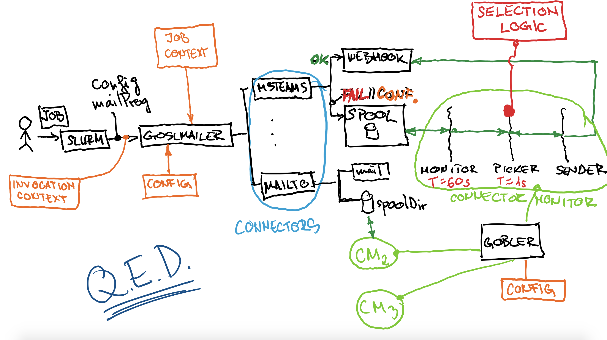

# goslmailer

---

## Description

**Goslmailer** (GoSlurmMailer) is a drop-in replacement [MailProg](https://slurm.schedmd.com/slurm.conf.html#OPT_MailProg) for [slurm](https://slurm.schedmd.com/).


With goslmailer configured as as the slurm mailer, 

```
MailProg                = /usr/bin/goslmailer
```

user can now specify a comma-separated list of *receivers* [[scheme:]target] where the messages will be sent out (similar to [URI scheme](https://en.wikipedia.org/wiki/Uniform_Resource_Identifier#Syntax).

e.g.

```
sbatch --mail-type=ALL --mail-user="mailto:useremail,msteams:username,username"
```

To support future additional receiver schemes, a [connector package](connectors/) has to be developed and its [configuration block](cmd/goslmailer/goslmailer.conf.annotated_example) present in configuration file.


## Spooling and throttling of messages - gobler service

In high-throughput clusters or in situations where job/message spikes are common, it might not be advisable to try to send all of the incoming messages as they arrive. 
For these environments goslmailer can be configured to spool messages from certain connectors on disk, to be later processed by the **gobler** service.


**gobler** is a daemon program that can be [configured](cmd/gobler/gobler.conf) to monitor specific spool directories for messages, process them and send out using the same connectors as goslmailer.


On startup, gobler reads its config file and spins-up a `connector monitor` for each configured spool directory.


`connector monitor` in turn spins up 3 goroutines: `monitor`, `picker` and `numSenders` x `sender`.

* **monitor** : 
  * every `monitorT` seconds (or miliseconds) scans the `spoolDir` for new messages and sends them to the **picker**

* **picker**  :
  * on receipt of new messages performs *trimming* of excessive messages, limiting the number of users messages in the system to `maxMsgPU`
  * every `pickerT` seconds (or miliseconds) picks the next message to be delivered and sends it to the **sender** (ordering by time of arrival)

* **sender**  :
  * `numSenders` goroutines are waiting for messages from the **picker** and try to deliver them. In case of failure, messages are returned to the **picker** for a later retry


## Artistic sketch of the system described above




## Currently supported receiver schemes:

* msteams webhook --mail-user=`msteams:`userid
* mailto --mail-user=`mailto:`email-addr

MoreToBeWritten...

## Connectors

### default connector 

Specifies which receiver scheme is the default one, in case when user didn't specify `--mail-user` and slurm sent a bare username.

```
"defaultconnector": "msteams"
```

### msteams

Sends a message to a preconfigured ms teams channel webhook.
From there, you can "easily" create a MS Power Automate workflow to pick the messages up and send them via private chat message to the intended user, or whatever else comes to your mind.

See [annotated configuration example](cmd/goslmailer/goslmailer.conf.annotated_example)

### mailto

Mailto covers for original slurm e-mail sending functionality, plus a little bit more.
In parameters, you can specify your e-mail command line prog (slurm: `MailProg`), template it's command line, message text and allowList/blockList the recipients.
(not all is implemented yet!)

See [annotated configuration example](cmd/goslmailer/goslmailer.conf.annotated_example)

---

## ToDo

See: [goslmailer project](https://github.com/users/pja237/projects/1/views/1)

---

## Gotchas

### msteams

* using adaptive card schema version 1.5 doesn't work with our adaptive card, check if some element changed in designer
    * tested: 1.0, 1.2 - work

## references

### msteams

* [Adaptive cards](https://adaptivecards.io/)
* [Adaptive cards - Designer](https://adaptivecards.io/designer/)
* [Rate limiting for connectors](https://docs.microsoft.com/en-us/microsoftteams/platform/webhooks-and-connectors/how-to/connectors-using?tabs=cURL#rate-limiting-for-connectors)
* [Bot optimizing for rate limiting](https://docs.microsoft.com/en-us/microsoftteams/platform/bots/how-to/rate-limit#)

